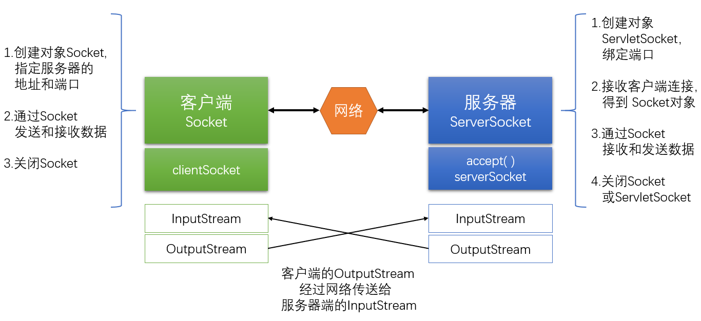
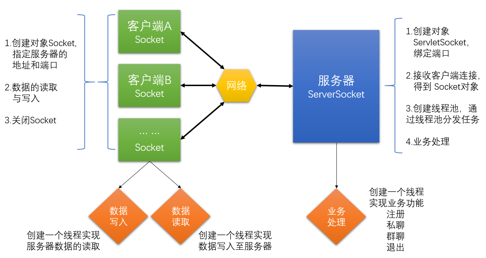

##项目名称
网络聊天室

##项目描述
支持多客户端的网络聊天室（群聊、私聊）

##使用技术
+Java基础
+Socket编程
+多线程

##项目功能
+注册
+私聊
+群聊
+退出

##项目实现


+服务端：采用线程池调度器执行服务器与客户端业务处理逻辑
    +用户注册
    +用户私聊
    +用户群聊
    +用户退出
+客户端：采用读写线程，分别处理交互与服务器数据接收
    +发送信息
    +接收信息

##测试结果
+平均响应时间：100ms
+支持同时在线用户：1000+

##项目总结
+熟悉项目的开发流程(需求、分析、技术选择、设计、编码、测试、发布)
+掌握Java网络编程的常用API及步骤
+熟练使用多线程
+提升了多线程优点的认识
+加深Maven工具的理解和掌握

##优化与扩展
+优化
    +参数校验不严谨
    +异常信息处理
    +用户体验(信息展示)
+扩展
    +数据存储到存储引擎(MySQL)
    +注册信息存储
    +增加登录功能(用户名+密码)
    +注销功能
    +存储历史消息

##参与项目
+克隆项目到本地
```Java
git clone git地址

···Java
cd chat-room
+提交项目到仓库
```Java
git add.
```Java
git commit -m xxx
```Java
git push origin master
